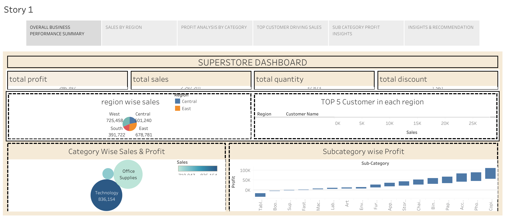

# 🛒 Superstore Sales Dashboard (Tableau)

This repository contains an interactive Tableau dashboard and storyboard based on the popular Superstore dataset.

## 📊 Visualizations Included:
- Total Profit, Sales, Quantity, and Discount KPIs
- Sales by Region
- Profit by Category
- Top 5 Customers by Region
- Sub-Category Profit Insights

## 📘 Summary
The story highlights key business insights to help improve sales strategy, product focus, and regional performance.

## 📂 Files
- Superstore_Dashboard.twbx – Tableau packaged workbook
- Superstore_Story.pdf – Exported storyboard in PDF format
- dashboard_preview.png – Screenshot of the dashboard

## 📌 Tools Used
- Tableau Desktop
- Superstore Sample Dataset
